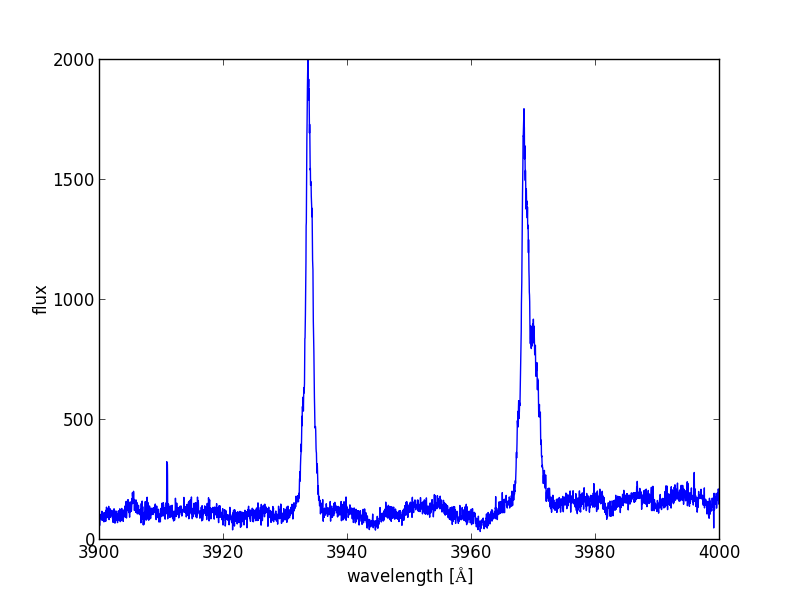
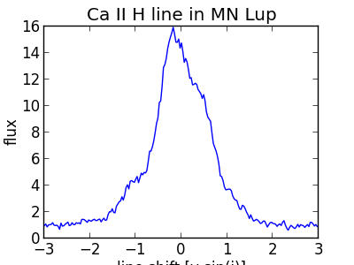
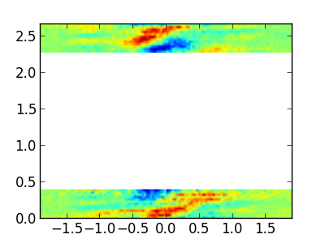
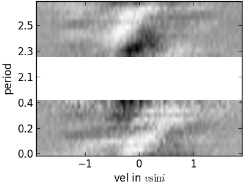

Analyzing UVES Spectrocopy with Astropy
=======================================

This tutorial follows my real live data analysis of MN Lup and the code developed
below is taken (with only minor modifications) from the code that I used to
actually prepare the publication. The plots that will be developed below
appear in very similar form in the article submitted to ApJ.

I will update this page with a proper reference once the article is accepted ;-)

The examples below depend on each other and the plots in the last section make
use of things calculated in the earlier sections. Thus, if you need to restart
your python session in the course of this tutorial, please execute all the code
again.

Also, this tutorial works best if you follow along and execute the code shown
on your own comupter. The page is already quite long and I do not include the
output you would see on your screen in this decument.

.. toctree::

Before you proceed
------------------
Please download this
:download:`this tar file <../downloads/astropy_UVES.tar.gz>` and extract
the content, either by clicking on the link or by executing this
python code::

    import urllib2, tarfile
    url = 'http://python4astronomers.github.io/_downloads/astropy_UVES.tar.gz'
    tarfile.open(fileobj=urllib2.urlopen(url), mode='r|*').extractall()
    cd UVES
    ls

Then start up IPython with the ``--pylab`` option to enable easy plotting::

    ipython --pylab

Acknowledgments
---------------

:Authors: Moritz Guenther
:Copyright: 2013 Moritz Guenther

Based on observations made with ESO Telescopes at the La Silla Paranal Observatory
under program ID 087.V0991(A).

Scientific background
---------------------
In this tutorial we analyze data from MN Lup, a T Tauri star in the
Taurus-Auriga star forming region located at a distance of about 140 pc. MN Lup
has been observed simultaneously with XMM-Newton and the UVES spectrograph on the
VLT. MN Lup is suspected to be a classical T Tauri star, that is accreting mass
from a circumstellar disk. MN Lup has been Doppler imaged by `Strassmeier et al.
(2005, A&A, 440, 1105) <http://adsabs.harvard.edu/abs/2005A%26A...440.1105S>`_
with a very similar UVES setup and those authors claim an rotationally modulated
accretion spot.

In the X-ray data we find moderate indications for accretion. In this
tutorial we analyze (some of) the UVES data to search for rotationally modulated
features in the emission line profiles, which could be due to an accretion spot
on the stellar surface.

Reading the data
----------------
The previous astropy tutorial already covered
:ref:`handling-fits-files` and :ref:`wcs-transformations`, so the explanation here
is only very brief. Check the `astropy documentation <http://docs.astropy.org>`_
or the other two tutorials for more details::

    from glob import glob

    import numpy as np

    from astropy.wcs import WCS
    from astropy.io import fits

    # glob searches through directories similar to the Unix shell
    filelist = glob('*.fits')
    # sort alphabetically - given the way the filenames are
    # this also sorts in time
    filelist.sort()

Read the first fits file in the list and check what is in there::
    
    sp = fits.open(filelist[0])
    sp.info()

We see that the data is given as the primary image and all other info is
part of the primary header. So, we can extract the WCS from that header
to get the wavelength coordinate::
    
    header = sp[0].header

    wcs = WCS(header)
    #make index array
    index = np.arange(header['NAXIS1'])

    wavelength = wcs.wcs_pix2world(index[:,np.newaxis], 0)
    wavelength.shape
    #Ahh, this has the wrong dimension. So we flatten it.
    wavelength = wavelength.flatten()

The flux is contained in the primary image::
    
    flux = sp[0].data

    
Making code reusable as a function
----------------------------------

Now, we do not want to repeat this process for every single file by hand,
so let us define a function that takes the filename as input and returns
the wavelength and flux arrays and the time of the observation.
In python, functions are created with the ``def`` statements.
All lines that have an itendation level below the `def` statement are part
of the function. Functions can (but do not have to) return values using
the ``return`` statement.

If a function ``func`` is contained in a file called ``spectra_utils.py`` in
the current directory, then this file can be imported into a python session in
order to use the function `func` with the following command::

    import spectra_utils
    a = spectra_utils.func(param1, param2, ...)

Alternatively, you can import just one (or a few) of many different functions
that are defined in your file ``spectra_utils.py``::

    from spectra_utils import func
    a = func(param1, param2, ...)

You will recognize that python does not make a difference between modules that come
with python (e.g. `glob`), external modules (e.g. `numpy` or `astropy`) and modules
that you write yourself. The syntax to import those modules or functions
is the same in all cases, provided that the directory where your module is
defined is in the search path (`more about python modules and the search path
<http://docs.python.org/2/tutorial/modules.html>`_).

.. note::
    You can also define a function on the interactive interpreter by just
    typing it line by line. However, 
    if you work in an interactive session, then the function ends as soon as there
    is a blank line. This makes it a little inconvenient to copy and paste more
    than the simplest functions into an interpreter.
    Fortunately, ipython offers two magic functions that take care of this:

    #) You can mark code in some editor, copy it to the clipboard and then
       type ``%paste`` in ipython.
    #) You type ``%cpaste`` in ipython you can paste code (e.g. with the
       mouse) and ipython will correct the leading number of whitespaces and
       ignore empty lines.
          
    These two tricks can be used with any type of code, but are particularly useful
    to define functions.

.. note::
    Once you used ``import spectra_utils`` python will not monitor the source file.
    If you change the source code of ``func`` in the file, you need to
    ``reload(spectra_utils)`` to load the new version of ``func``.

So, after all this discussion, we can now define a function that automates the
loading of a single spectrum using the commands we developed above. Even if
this function is fairly short, we still add some documenation to the header,
so that we can look up what parameters it needs when we come back to this
project a while later. Personally, I comment every function that is longer
than two lines::

    def read_spec(filename):
        '''Read a UVES spectrum from the ESO pipeline

        Parameters
        ----------
        filename : string
           name of the fits file with the data

        Returns
        -------
        wavelength : np.ndarray
            wavelength (in Ang)
        flux : np.ndarray
            flux (in erg/s/cm**2)
        date_obs : string
            time of observation
        '''
        sp = fits.open(filename)
        header = sp[0].header

        wcs = WCS(header)
        #make index array
        index = np.arange(header['NAXIS1'])

        wavelength = wcs.wcs_pix2world(index[:,np.newaxis], 0)
        wavelength = wavelength.flatten()
        flux = sp[0].data

        date_obs = header['Date-OBS']
        return wavelength, flux, date_obs

.. admonition::  Excercise

    Try to find out how you can read the help for this function from the
    command line.
.. raw:: html

   
Click to Show/Hide Solution
 

::

    help(read_spec)
    #or
    read_spec?

.. raw:: html

   

.. admonition::  Excercise

    The dataset of UVES spectra should have been taken using all the same setup.
    Write a function that returns the exposure time (``EXPTIME``),
    the wavelength zero point
    (``CRVAL1``), and the arm used (UVES has a red and a blue arm - see keyword
    ``HIERARCH ESO INS PATH``). Then check that all exposures have the same
    setup.
    
    
.. raw:: html

   
Click to Show/Hide Solution
 

::

    def read_setup(filename):
        '''Get setup for UVES spectrum from the ESO pipeline

        Parameters
        ----------
        filename : string
           name of the fits file with the data

        Returns
        -------
        exposure_time : float
        wavelength_zero_point : float
        optical_arm : string
        '''
        sp = fits.open(filelist[0])
        header = sp[0].header

        return header['EXPTIME'], header['CRVAL1'], header['HIERARCH ESO INS PATH']

    # Let's just print the setup on the screen
    # We'll see if it's all the same.
    for f in filelist:
        print read_setup(f)

.. raw:: html

   

The UVES pipeline that was used to reduce the data that we use in the this example
employs a fixed wavelength grid (see excercise above),
thus the ``wavelength`` is the same for all spectra.
This makes it easy to define an array that can hold the fluxes of all
observations. Then, we loop over the list of all filenames and fill this array
with data::

    flux = np.zeros((len(filelist), len(wavelength)))
    # date comes as string with 23 characters (dtype = 'S23')
    date = np.zeros((len(filelist)), dtype = 'S23')

    for i, fname in enumerate(filelist):
        w, f, date_obs = read_spec(fname)
        flux[i,:] = f
        date[i] = date_obs

Units and constants in astropy
------------------------------
Often, one has to keep track of the units for certain values. Was the wavelength
given in Angstroem or in nm? In X-ray observations, a common unit of wavelength is
keV. How many nm is 0.65 keV?
`astropy.units <http://docs.astropy.org/en/v0.2.1/units/index.html>`_
offers a framework that can take
care of this book-keeping and propagate the units through many (but not all)
mathematical operations (e.g. addition, division, multiplication). 
Furthermore, 
`astropy.constants <http://docs.astropy.org/en/v0.2.1/constants/index.html>`_  supplies the values of
many physical and astronomical constants.
The easiest way to attach a unit to a number is by multiplication::

    import astropy.units as u
    from astropy.constants.si import c, G, M_sun, R_sun

    wavelength = wavelength * u.AA

    # Let's define some constants we need for the excersices further down
    # Again, we multiply the value with a unit here
    heliocentric = -23. * u.km/u.s
    v_rad = -4.77 * u.km / u.s  # Strassmeier et al. (2005)
    R_MN_Lup = 0.9 * R_sun      # Strassmeier et al. (2005)
    M_MN_Lup = 0.6 * M_sun      # Strassmeier et al. (2005)
    vsini = 74.6 * u.km / u.s   # Strassmeier et al. (2005)
    period = 0.439 * u.day      # Strassmeier et al. (2005)
    
    inclination = 45. * u.degree # Strassmeier et al. (2005)
    # All numpy trigonometric functions expect the input in radian.
    # So far, astropy does not know this, so we need to convert the
    # angle manually
    incl = inclination.to(u.radian)

Now, we can use those variables in our calculations. MN Lup is a T Tauri
star (TTS), which is possibly surrounded by an accretion disk. In the spectra
we will be looking for signatures of accretion. We expect those accretion
signatures to appear close to the free-fall velocity v that a mass m reaches, when
it hits the stellar surface. We can calculate the infall speed using simple
energy conservation:

.. _formula-vaccr:

.. math::
    E_{kin}  =  E_{grav}

    \frac{1}{2} m v^2  =  G \frac{m M_*}{R_*}

So, let us calculate the free-fall velocity for MN Lup::

    >>> v_accr = (2.* G * M_MN_Lup/R_MN_Lup)**0.5 
    >>> print v_accr
    504469.027564 m / (s)
    >>> # Maybe astronomers prefer it in the traditional cgs system?
    >>> print v_accr.cgs
    50446902.7564 cm / (s)
    >>> # Or in some really obscure unit?
    >>> print v_accr.to(u.mile / u.hour)
    1128465.07598 mi / (h)

How does the accretion velocity relate to the rotational velocity?
::
  
    v_rot = vsini / np.sin(incl)
    v_accr / v_rot

Oh, what is that? The seconds are gone, but ``astropy.quantity`` objects keep
their different length units unless told otherwise::

    (v_accr / v_rot).decompose()

The reason for this is that it is not uncommon to use different length units in
a single constant, e.g. the Hubble constant is commonly given in "km/ (s * Mpc)".
"km" and "Mpc" are both units of length, but generally you do *not* want to
shorten this to "1/s".

We can now use the ``astropy.units`` mechanism to correct the wavelength
scale to the heliocentric velocity scale:

.. math::

    \lambda_{heliocentric} = \lambda_{bariocentric} * (1 + \frac{v_{helio}}{c})
    
Naively, we could try::

    wavelength = wavelength * (1. + heliocentric/c)
    TypeError: unsupported operand type(s) for +: 'float' and 'Quantity'

However, this fails, because ``heliocentric/c`` is in units of "km/m" and ``1.``
is just a number. From the notation above, it is not clear what we actually want.
Do we ask for the value of ``heliocentric/c + 1.`` or do we want to simplify the
units of  ``heliocentric/c`` and after that add ``1.``?
There are several ways to make the instruction precise, 
but one is to explicitly add ``u.dimensionless_unscaled`` to ``1.``
to tell astropy that this number is dimensionless and does not carry any scaling::

    wavelength = wavelength * (1. * u.dimensionless_unscaled+ heliocentric/c)

I want to mention one more feature here (check out 
`astropy.units <http://docs.astropy.org/en/v0.2.1/units/index.html>`_ for
more): The ability to convert the spectral axis to frequencies or energies.
Normally, a unit of length is not equivalent to a unit of energy or to a
frequency, but this conversion makes sense for the wavelength of a spectrum.
This is how it can be done::

    wavelength.to(u.keV, equivalencies=u.spectral())
    wavelength.to(u.Hz, equivalencies=u.spectral())

.. admonition::  Excercise

    Spectrocopically, MN Lup is classified as spctral type M0 V, thus
    the gravitational acceleration on the surface :math:`\log(g)` 
    should be comparable to the sun.
    (For non-stellar astronomers: Conventionlly, all values are given
    in the cgs system. The value for the sun is :math:`\log(g) = 4.4`.)
   
    Calculate :math:`\log(g)` for MN Lup with the values for the mass
    and radius given above. Those values were determined from 
    evolutionary tracks. Check if the :math:`\log(g)` is consistent
    with the value expected from spectroscopy.
    
.. raw:: html

   
Click to Show/Hide Solution
 

The values from evolutionary tracks are indeed consistent with the 
spectroscopically estimated surface gravity::
   
    >>> print np.log10((G*M_MN_Lup/R_MN_Lup**2).cgs)
    4.3080943799180433

.. raw:: html

   

.. admonition::  Excercise

    Write a function that turns a wavelength scale into a velocity scale.
    We want to input a wavelengths array and the rest wavelength of a spectal
    line. We need this function later to show the red- and blueshift of the
    spectrum relativ to the the Ca II H line. Use the following definition
    to make sure the that code below can use it later::

        def wave2doppler(wavelength_array, wavelength_line):
            .. do something ..
            return array_of_dopplershifts

    You can test if you function works by calculating the a Dopplershift
    of the following wavelenghts relative to :math:`H_\alpha`::

        waveclosetoHa = np.array([6562.,6563,6565.]) * u.AA
        print wave2doppler(waveclosetoHa, 656.489 * u.nm)

    I get -132, -86 and +5 km/s.
    
.. raw:: html

   
Click to Show/Hide Solution
 

::

    def wave2doppler(w, w0):
        doppler = ((w-w0)/w0 * c)
        return doppler

    print wave2doppler(waveclosetoHa, 656.489 * u.nm).decompose().to(u.km/u.s)

.. raw:: html

   

.. admonition::  Excercise

    Write a function that takes a wavelength array and the rest wavelength of
    a spectral line as input, turns it into a Doppler shift (you can use
    the function from the last excercise),
    subtracts the radial velicty of MN Lup (4.77 km/s) and expresses
    the resulting velocity in units of vsini.
    We need this function later to show the red- and blueshift of the
    spectrum relative to the Ca II H line. Use the following definition
    to make sure the that code below can use it later::

        def w2vsini(wavelength_array, wavelength_line):
            .. do something ..
            return array_of_shifts_in_vsini

.. raw:: html

   
Click to Show/Hide Solution
 

::

    def w2vsini(w, w0):
        v = wave2doppler(w, w0) - 4.77 * u.km/u.s
        return v / vsini

.. raw:: html

   

Converting times
----------------
`astropy.time <http://docs.astropy.org/en/v0.2.1/time/index.html>`_ 
provides methods to convert times and dates between different
systems and formats. Since the ESO fits headers already contain the time of the
observation in different systems, we could just read the keyword in the time
system we like, but we will use ``astropy.time`` to make this conversion here.
``astropy.time.Time`` will parse many common imput formats (strings, floats), but
unless the format is umambiguous the format needs to be specified (e.g. a number
could mean JD or MJD or year). Also, the time system needs to be given (e.g. UTC).
Below are several examples, initialized from different header keywords::

    from astropy.time import Time
    t1 = Time(header['MJD-Obs'], format = 'mjd', scale = 'utc')
    t2 = Time(header['Date-Obs'], scale = 'utc')

Times can be expressed in different formats::

    >>> t1
    <Time object: scale='utc' format='mjd' vals=55784.9749105>
    >>> t1.isot
    '2011-08-11T23:23:52.266'
    >>> t2
    <Time object: scale='utc' format='isot' vals=2011-08-11T23:23:52.266>

or be converted to a different time system::

    >>> t1.tt
    <Time object: scale='tt' format='mjd' vals=55784.9756765>
    
Times can also be initialized from arrays and we can calculate time differences::

    obs_times = Time(date, scale = 'utc')
    delta_t = obs_times - Time(date[0], scale = 'utc')

Now, we want to express the time difference between the individual spectra of
MN Lup in rotational periods. While the unit of ``delta_t`` is days, unfortunately
``astropy.time.Time`` and ``astropy.units.Quantity`` objects do not work together
yet, so we will have to convert from one to the other explictly::

    delta_p = delta_t.val * u.day / period

Normalize the flux to the local continuum
-----------------------------------------
In this example we want to look at the time evolution of a single specific
emission line in the spectrum. In order to estimate the equivalent width
or make reasonable plots we need to normalize the flux to the local continuum.
In this specific case the emission line is bright and the continuum can be
described reasonably by a second-order polynomial.

So, we define two regions left and right of the emission line, where we fit the
polynomial. Looking at the figure, ``[3925*u.AA, 3930*u.AA]`` and
``[3938*u.AA, 3945*u.AA]`` seem right for that. Then, we normalize the flux by
this polynomial.

The following function will do that::

    def region_around_line(w, flux, cont):
        '''cut out and normalize flux around a line

        Parameters
        ----------
        w : 1 dim np.ndarray
            array of wanvelenghts
        flux : np.ndarray of shape (N, len(w))
            array of flux values for different spectra in the series
        cont : list of lists
            wavelengths for continuum normalization [[low1,up1],[low2, up2]]
            that described two areas on both sides of the line
        '''
        #index is true in the region where we fit the polynomial
        indcont = ((w > cont[0][0]) & (w < cont[0][1])) |((w > cont[1][0]) & (w < cont[1][1]))
        #index of the region we want to return
        indrange = (w > cont[0][0]) & (w < cont[1][1])
        # make a flux array of shape
        # (nuber of spectra, number of pointsin indrange)
        f = np.zeros((flux.shape[0], indrange.sum()))
        for i in range(flux.shape[0]):
            # fit polynom of second order to the continuum region
            linecoeff = np.polyfit(w[indcont], flux[i, indcont],2)
            # devide the flux by the polynom and put the result in our
            # new flux array
            f[i,:] = flux[i,indrange]/np.polyval(linecoeff, w[indrange])
        return w[indrange], f

    wcaII, fcaII = region_around_line(wavelength, flux, 
                   [[3925*u.AA, 3930*u.AA],[3938*u.AA, 3945*u.AA]])

Publication ready output
------------------------

Tables
^^^^^^
We will calculate the equivalent width in Angstroems of the emission line
for the first spectrum::

    ew = fcaII[0,:] - 1.
    ew = ew[:-1] * np.diff(wcaII.to(u.AA).value)
    print ew.sum()

Using ``numpy`` array notation we can actually process all spectra at once::

    delta_lam = np.diff(wcaII.to(u.AA).value)
    ew = np.sum((fcaII - 1.)[:,:-1] * delta_lam[np.newaxis, :], axis=1)
    
Now, we want to generate a LaTeX table of the observation times, period
and equivalent width that we can directly paste into our manuscript. To do so,
we first collect all the columns and make an ``astropy.table.Table`` object. (Please
check `astropy.table <http://docs.astropy.org/en/v0.2.1/table/index.html>`_
or :ref:`tabular-data` for more
details on ``Table``). So, here is the code::

    from astropy.table import Column, Table
    import astropy.io.ascii as ascii

    datecol = Column(name = 'Obs Date', data = date)
    pcol = Column(name = 'phase', data = delta_p, format = '{:.1f}')
    ewcol = Column(name = 'EW', data = ew, format = '{:.1f}', units = '\\AA')
    tab = Table((datecol, pcol, ewcol))
    # latexdicts['AA'] contains the style specifics for A&A (\hline etc.)
    tab.write('EWtab.tex', latexdict = ascii.latexdicts['AA'])
    
Plots
^^^^^
We will make two plots. The plotting is done with
`matplotlib <http://matplotlib.org>`_, and does not involve Astropy itself.
Plotting is introduced in :ref:`plotting-and-images` and more details on
plotting can be found there. When in doubt, use the seach engine of your choice
and ask the internet. Here, I mainly want to illustrate that Astropy can be
used in real-live data analysis.
Thus, I do not explain every step in the plotting in detail.
The plots we produce below appear in very
similar form in Guenther et al. 2013 (ApJ, submitted).

In both cases we want the x-axis to show the Doppler shift expressed in units
of the rotational velocity. In this way, features that are rotationally
modulated will stick out between -1 and +1::

    x = w2vsini(wcaII, 393.366 * u.nm).decompose()

First, we will show the line profile::

    import matplotlib.pyplot as plt
    # set reasonable figsize for 1-column figures
    fig = plt.figure(figsize = (4,3))
    ax = fig.add_subplot(1,1,1)
    ax.plot(x, fcaII[0,:])
    ax.set_xlim([-3,+3])
    ax.set_xlabel('line shift [v sin(i)]')
    ax.set_ylabel('flux')
    ax.set_title('Ca II H line in MN Lup')
    # when using this interface, we need to explicitly call the draw routine
    plt.draw()

.. admonition::  Excercise

    The plot above shows only a single spectrum. Plot all spectra into a single
    plot and introduce a sensible offset between them, so that we can follow
    the time evolution of the line.

.. raw:: html

   
Click to Show/Hide Solution
 

There are clearly several ways to produce a well looking plot. Here is one
way::

    yshift = np.arange((fcaII.shape[0])) * 0.5
    #shift the second night up by a little more
    yshift[:] += 1.5
    yshift[13:] += 1

    fig = plt.figure(figsize = (4,3))
    ax = fig.add_subplot(1,1,1)
        
    for i in range(25):
        ax.plot(x, fcaII[i,:]+yshift[i], 'k')

    #separately show the mean line profile in a different color
    ax.plot(x, np.mean(fcaII, axis =0), 'b')
    ax.set_xlim([-2.5,+2.5])
    ax.set_xlabel('line shift [$v \\sin i$]')
    ax.set_ylabel('flux')
    ax.set_title('Ca II H line in MN Lup')
    fig.subplots_adjust(bottom = 0.15)
    plt.draw()

.. image:: CaII-lines-all.png
   :scale: 100%
   :align: center

.. raw:: html

   

Next, we will make a more advanced plot. For each spectrum we calculate
the difference to the mean flux::

    fmean = np.mean(fcaII, axis=0)
    fdiff = fcaII - fmean[np.newaxis,:]

In the following simple plot, we can already see features moving through the line.
However, the axis scales are not right, the gap between both nights is not visible
and there is no proper labelling::

    fig = plt.figure(figsize = (4,3))
    ax = fig.add_subplot(1,1,1)
    im = ax.imshow(fdiff, aspect = "auto", origin = 'lower')

.. image:: CaII-1.png
   :scale: 100%
   :align: center

In the following, we will plot the spectra from both nights separately.
Also, we will pass the ``extent`` keyword to ``ax.imshow`` which takes care
of the axis::

    ind1 = delta_p < 1 * u.dimensionless_unscaled
    ind2 = delta_p > 1 * u.dimensionless_unscaled

    fig = plt.figure(figsize = (4,3))
    ax = fig.add_subplot(1,1,1)

    for ind in [ind1, ind2]:
        im = ax.imshow(fdiff[ind,:], extent = (np.min(x), np.max(x), np.min(delta_p[ind]), np.max(delta_p[ind])), aspect = "auto", origin = 'lower')
        
    ax.set_ylim([np.min(delta_p), np.max(delta_p)])
    ax.set_xlim([-1.9,1.9])
    plt.draw()

Now, this plot is already much better, but there are still some things that can be
improved:

* Introduce an offset on the y-axis to reduce the amount of white space.
* Stricly speaking, the image shown is not quite the right scale because the
   ``extent`` keyword gives the edges of the image shown, while ``x`` and
   ``delta_p`` contain the bin mid-points.
* Use a grey scale instead of color to save publication charges.
* Add labels to the axis.

The following code addresses these points::

    # shift a little for plotting purposes
    pplot = delta_p.copy().value
    pplot[ind2] -= 1.5
    # image goes from x1 to x2, but really x1 should be middle of first pixel
    delta_t = np.median(np.diff(delta_p))/2.
    delta_x = np.median(np.diff(x))/2.
    # imshow does the normalization for plotting really well, but here I do it
    # by hand to ensure it goes -1,+1 (that makes color bar look good)
    fdiff = fdiff / np.max(np.abs(fdiff))

    fig = plt.figure(figsize = (4,3))
    ax = fig.add_subplot(1,1,1)

    for ind in [ind1, ind2]:
        im = ax.imshow(fdiff[ind,:], 
             extent = (np.min(x)-delta_x, np.max(x)+delta_x, 
                       np.min(pplot[ind])-delta_t, np.max(pplot[ind])+delta_t),
             aspect = "auto", origin = 'lower', cmap = plt.cm.Greys_r)
        
    ax.set_ylim([np.min(pplot)-delta_t, np.max(pplot)+delta_t])
    ax.set_xlim([-1.9,1.9])
    ax.set_xlabel('vel in $v\\sin i$')
    ax.xaxis.set_major_locator(plt.MaxNLocator(4))
 
    def pplot(y, pos):
        'The two args are the value and tick position'
        'Function to make tick labels look good.'
        if y < 0.5:
            yreal = y
        else:
            yreal = y + 1.5
        return yreal

    formatter = plt.FuncFormatter(pplot)
    ax.yaxis.set_major_formatter(formatter)
    ax.set_ylabel('period')
    fig.subplots_adjust(left = 0.15, bottom = 0.15, right = 0.99, top = 0.99)
    plt.draw()

.. admonition::  Excercise

    Understand the code for the last plot. Some of the commands used are
    already pretty advanced stuff. Remember, any internet search engine can be
    your friend.
    
.. raw:: html

   
Click to Show/Hide Solution
 

Clearly, I did not develop this code for scratch.
The `matplotlib gallery <http://matplotlib.org/gallery.html>`_ is my
preferred place to look for plotting solutions.

.. raw:: html

   

Contributing to Astropy
-----------------------
`Astropy <http://astropy.org>`_ is an open-source and community-developed
Python package, which means that is only as good as the contribution of the
astronomical community. Clearly, there will always people who have more fun writing
code and others who have more fun using it. However, if you find a bug and do not
report it, then it is unlikely to be fixed. If you wish for a specific feature,
then you can either implement it and contribute it or at least fill in a feature
request.

If you want to get help or discuss issues with other Astropy users, you can
sign up for the `astropy mailing list
<http://mail.scipy.org/mailman/listinfo/astropy>`_.
Alternatively, the `astropy-dev
<http://groups.google.com/group/astropy-dev>`_ list is where you should go to
discuss more technical aspects of Astropy with the developers.

If you have come across something that you believe is a bug, please open a
ticket in the Astropy `issue tracker
<http://github.com/astropy/astropy/issues>`_, and we will look into it
promptly.

Please try to include an example that demonstrates the issue and will allow the
developers to reproduce and fix the problem.  If you are seeing a crash
then frequently it will help to include the full Python stack trace as well as
information about your operating system (e.g. MacOSX version or Linux version).

Here is a practical example. 
:ref:`Above <formula-vaccr>` we calculated the free-fall
velocity onto MN Lup like this::

    v_accr = (2.*G *M_MN_Lup / R_MN_Lup)**0.5

Mathematically, the following statement is equivalent::

    v_accr2 = np.sqrt((2.*G * M_MN_Lup/R_MN_Lup))

However, this raises a warning and automatically converts the quantity object
to an numpy array and the unit is lost. If you believe that is a bug that should
be fixed, you might chose to report it in the `issue tracker
<http://github.com/astropy/astropy/issues>`_.
(But please check if somebody else has reported the same thing before, so we do
not clutter the issue tracker needlessly.)
